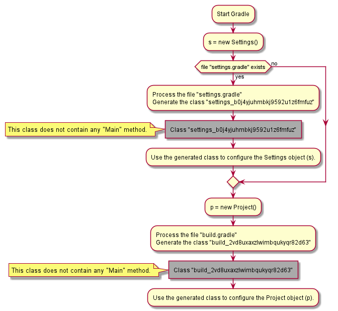

# Description

This repository contains an experimental Gradle project.

# Notes

The following concepts are very important to understand Gradle scripts:

* [Closure delegation](https://groovy-lang.org/closures.html#closure-owner) / [delegation strategy](https://groovy-lang.org/closures.html#_delegation_strategy).
* [Maps](https://www.tutorialspoint.com/groovy/groovy_maps.htm) and function calls.

## build.gradle

When you write this code (within `build.gradle`):

    tasks.register "hello", {
    
        doFirst() {
            println("hello:doFirst()")
        }
                
        doLast {
            println("hello:doLast()")
        }
    
    }

You can also write: 

    this.tasks.register("hello", {
    
        delegate.doFirst() {
            println("hello:doFirst()")
        }
                
        delegate.doLast {
            println("hello:doLast()")
        }
    
    })

* `this`, at script level, is an instance of a **runtime created** class which name
  looks something like `build_2vd8uxaxzlwimbqukyqr82d63`. This class implements
  the interface [org.gradle.api.Project](https://docs.gradle.org/current/javadoc/org/gradle/api/Project.html)
  (_see next section_).
* `tasks` points to the method defined by the interface [org.gradle.api.Project::getTasks()](https://docs.gradle.org/current/javadoc/org/gradle/api/Project.html).
* The closure delegate is not defined within the `build.gradle` script.
  * It is assigned **at runtime**.
  * It implements the interface [org.gradle.api.Task](https://docs.gradle.org/current/javadoc/org/gradle/api/Task.html).
    
The code bellow:

    version '1.0-SNAPSHOT'
    
Calls the method `org.gradle.api.Project::setVersion()`. It can be rewritten:

    this.setVersion('1.0-SNAPSHOT')

Special note about the following block:

    // Call org.gradle.plugin.use.internal.PluginsAwareScript::plugins()
    plugins {
        // Call PluginDependenciesSpec::PluginDependencySpec id(...)
        id 'java'
    }

See [this link](https://docs.gradle.org/6.3/userguide/plugins.html#sec:constrained_syntax):

> The plugins {} block does not support arbitrary code. It is constrained,
> in order to be idempotent (produce the same result every time) and side
> effect free (safe for Gradle to execute at any time).

And you should be aware that this block must be **the first block** defined
within the `build.gradle` file.

Links:

* [PluginDependenciesSpec](https://docs.gradle.org/current/dsl/org.gradle.plugin.use.PluginDependenciesSpec.html)
* [PluginsAwareScript](https://github.com/gradle/gradle/blob/master/subprojects/core/src/main/java/org/gradle/plugin/use/internal/PluginsAwareScript.java)

## settings.gradle

First an instance of a class that implements the interface
[Settings](https://docs.gradle.org/current/javadoc/org/gradle/api/initialization/Settings.html) is created by Gradle.

> Please note that the interface `Settings` defines the method `getRootProject()`.
> Also note that this instance is created by Gradle, and not by the script `settings.gradle`.

Then, the script `settings.gradle` is converted into a class which name looks something like `settings_b0j4yjuhmbkj9592u1z6fmfuz`.
This class is used to configure the previously instantiated object (which class implements the `Settings` interface).

When you write:

    rootProject.name = 'gradle1'

It executes the method `org.gradle.api.initialization.Settings::getRootProject()`.

# Gradle execution

